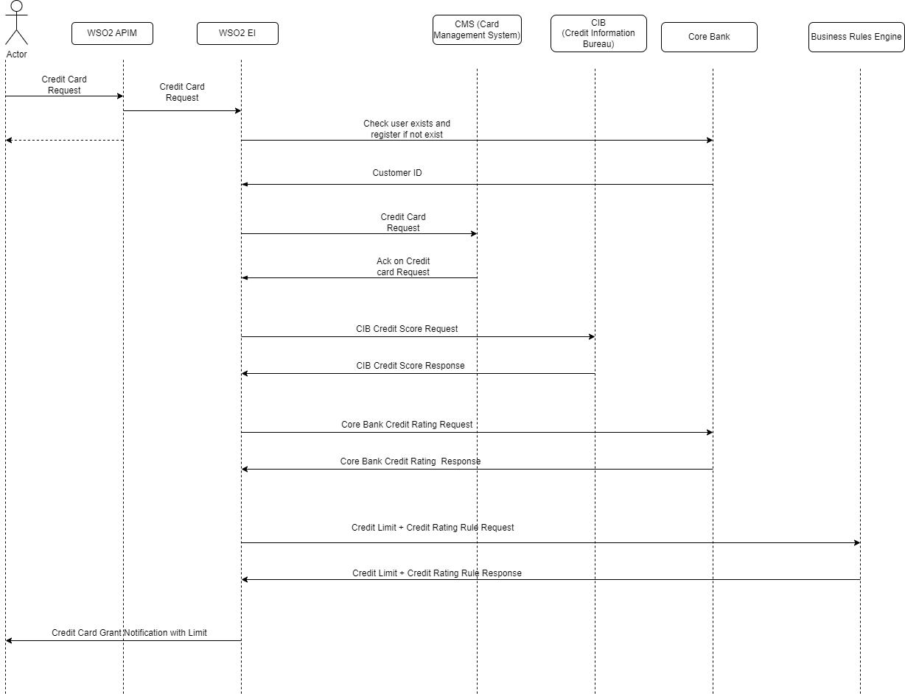
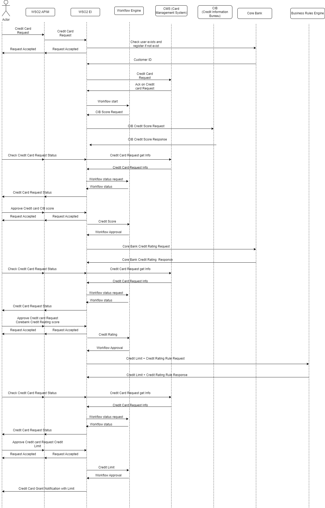
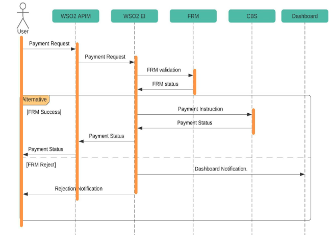
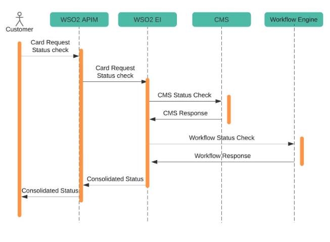

# Readme
# Project Deployment Guide

This guide provides detailed instructions for deploying the project locally with Micro Integrator or in a Dockerized environment.

## Pre-requisites

Before starting the deployment process, make sure you have done the followings:

1. **Integration Studio 8.2.0** : Download and install Integration Studio for project development. \
[Link to download](https://ei.docs.wso2.com/en/latest/micro-integrator/develop/installing-WSO2-Integration-Studio/)

2. **MI 4.2.0** : Download and install Micro Integrator to integrate microservices. \
[Link to download](https://wso2.com/micro-integrator/)

3. **APIM 4.2.0** : Download and install API Manager for managing APIs. \
[Link to download](https://wso2.com/api-manager/)

4. **Ballerina 2201.7.1** : Download and install Ballerina to run the services \
[Link to download](https://ballerina.io/downloads/)

5. **Docker** : Download and install Docker for containerizing and managing applications \
[Link to download](https://docs.docker.com/engine/install/)

6. **Postman collection** : Download the postman collection (BankingDemo.postman_collection) \
[Link to postman collection](https://github.com/wso2-enterprise/presales-pocs/blob/bankingdemobuild/BankingDemos/Postman%20Collection/BankingDemo.postman_collection.json)

This project covers three main use cases in the banking industry

[Use Case 1 - Credit Card Request And Approval](#use-case-1---credit-card-request-and-approval) \
This use case demonstrates the implementation of a Credit Card Request process and the Approval process on the Credit Card Applications.

**Features:**
- External Service Integration
- Handling endpoint failures
- Service Chaining
- Building payloads
- Response filtering
- Exposing the Integration Service as a Managed API on API Manager


**Mediators used:**

| Mediator                | Purpose    |
| ----------------------- | ------------------------------------------------------------------------------------------------------------------------------------------------------------------------------------------------------------------------------------------------------------------------------------------ |
| PayloadFactory Mediator | Dynamically generates JSON payloads to send through endpoints |
| Call Mediator           | Sends messages out of the Micro Integrator to an external   service.  |
| Filter Mediator         | Checks user's validity from the JSON response of the Core Bank Service , Checks the JSON response from the Business Rules Engine to accept or reject the credit card application. |
|Sequence Mediator | It refers to an already defined sequence element, which is used to invoke a named sequence of mediators|
| Property Group Mediator |  Modifies and sets properties, enabling the transfer of information between mediators and tasks in the workflow.
| Error Sequence          | Executes the ErrorSeq (Error Sequence) if any of the endpoints fail.  | 


[Use Case 1 (Version 2) - Credit Card Request And Approval with workflow engine](#use-case-1-version-2---credit-card-request-and-approval-with-workflow-engine) \
This use case demonstrates the implementation of a Credit Card Request process and the Approval process on the Credit Card Applications with workflow engine.

**Features:**
- External Service Integration
- Handling endpoint failures
- Service Chaining
- Building payloads
- Response filtering
- Activiti workflow engine Integration
- Exposing the Integration Service as a Managed API on API Manager

**Mediators used:**

| Mediator                | Purpose    |
| ----------------------- | ------------------------------------------------------------------------------------------------------------------------------------------------------------------------------------------------------------------------------------------------------------------------------------------ |
| PayloadFactory Mediator | Dynamically generates JSON payloads to send through endpoints |
| Call Mediator           | Sends messages out of the Micro Integrator to an external   service.  |
| Filter Mediator         | Checks user's validity from the JSON response of the Core Bank Service , Checks the JSON response from the Business Rules Engine to accept or reject the credit card application. |
|Sequence Mediator | It refers to an already defined sequence element, which is used to invoke a named sequence of mediators|
| Property Group Mediator |  Modifies and sets properties, enabling the transfer of information between mediators and tasks in the workflow.
| Error Sequence          | Executes the ErrorSeq (Error Sequence) if any of the endpoints fail.  |

[Use Case 2 - Credit Card Payment](#use-case-2---credit-card-payment) \
This use case demonstrates the implementation of a Credit Card payment process.

**Features:**
- External Service Integration
- Handling endpoint failures
- Service Chaining
- Building payloads
- Response filtering
- Sending email
- Exposing the Integration Service as a Managed API on API Manager

**Mediators and Connectors used:**

| Mediator                | Purpose    |
| ----------------------- | ------------------------------------------------------------------------------------------------------------------------------------------------------------------------------------------------------------------------------------------------------------------------------------------ |
| PayloadFactory Mediator | Dynamically generates JSON payloads to send through endpoints |
| Call Mediator           | Sends messages out of the Micro Integrator to an external   service.  |
| Filter Mediator         | Checks user's fraud details from the JSON response of the Fraud Risk Management (FRM) System. |
|Email Connector | Sends email to the Online Banking System if the payment is successful and sends email to the card holder and the Online Banking System if it's failed.|
| Property Group Mediator |  Modifies and sets properties, enabling the transfer of information between mediators and tasks in the workflow.
| Error Sequence          | Executes the ErrorSeq (Error Sequence) if any of the endpoints fail.  |

 [Use Case 3 - Credit Card Status Tracking](#use-case-3---credit-card-status-tracking) \
This use case demonstrates the implementation of a Credit Card registration Status tracking.

**Features:**
- External Service Integration
- Handling endpoint failures
- Service Chaining
- Building payloads
- Response filtering
- Exposing the Integration Service as a Managed API on API Manager

**Mediators used:**

| Mediator                | Purpose    |
| ----------------------- | ------------------------------------------------------------------------------------------------------------------------------------------------------------------------------------------------------------------------------------------------------------------------------------------ |
| PayloadFactory Mediator | Dynamically generates JSON payloads to send through endpoints |
| Call Mediator           | Sends messages out of the Micro Integrator to an external   service.  |
| Filter Mediator         | Checks validity of the application id from the JSON response of the Credit Management System (CMS)  |
| Property Group Mediator |  Modifies and sets properties, enabling the transfer of information between mediators and tasks in the workflow.
| Error Sequence          | Executes the ErrorSeq (Error Sequence) if any of the endpoints fail.  |

**Mediators used:**
- Call Mediator
- Property Group Mediator
- Filter Mediator
- PayloadFactory Mediator

## Use Case 1 - Credit Card Request And Approval 

### Overview

This use case demonstrates the implementation of a Credit Card Request process and the Approval process on the Credit Card Applications.

When a user submits a credit card request, the system initiates a validation check with the Core Banking System to verify the accuracy of the provided user details. In the event of invalid information, the system prompts the user to complete the registration process.

Upon successful validation, the Credit Card Management System (CMS) generates a unique application ID for the request and stores it in a file marked with an "in approval" status. Subsequently, the Credit Information Bureau (CIB) provides the user's credit score details, followed by the Core Banking System supplying additional credit score information.

Then, the Business Rules Engine assesses the user's credit score and credit rating to determine the approval status of the request. If the request meets the approval criteria, the system responds with comprehensive request details, including the approved credit limit. Concurrently, the Credit Card Management System updates the request status to reflect approval.

In cases where the Business Rules Engine rejects the request due to an insufficient credit rating, the response includes the reason for the rejection. The Credit Card Management System then updates the status of the request accordingly, marking it as rejected.



### Example Requests and Responses of the services

- Core Banking System - User Information request \
[https://github.com/orgs/wso2-enterprise/projects/262/views/1?pane=issue&itemId=43031199]

- Credit Card Management System (CMS) - Credit Card application request \
[https://github.com/orgs/wso2-enterprise/projects/262/views/1?pane=issue&itemId=40983843]

- Credit Information Bureau (CIB) - Credit score request \
[https://github.com/orgs/wso2-enterprise/projects/262/views/1?pane=issue&itemId=41107160]

- Core Banking System - Credit rating request \
[https://github.com/orgs/wso2-enterprise/projects/262/views/1?pane=issue&itemId=43031199]

- Business Rules Engine - Credit score and rating validation request \
[https://github.com/orgs/wso2-enterprise/projects/262/views/1?pane=issue&itemId=43165671]

### Pre-requisites
Docker images for the following Ballerina services should be built
> - CMS Credit Card Request Application Service (CMS)
> - Core Bank Service (CoreBank)
> - CIB Credit Score Request Service (CIB)
> - Business Rules Engine credit validation service (BusinessRulesEngine)

#### Step 1 : Navigate to each service directory in the terminal.

#### Step 2 : Execute bal build \--cloud=docker to generate the artifacts and build the image for all individual Ballerina services.

> ```
>bal build --cloud=docker
>```

If you face undefined module error, pull the relevant modules

### Option 1 : Local Micro Integrator Deployment

#### Prerequisites

- Add the following entry to `your system's host file`:
>```plaintext
>127.0.0.1       core-bank
>127.0.0.1       cms
>127.0.0.1       cib
>127.0.0.1       bre
>```
>This entry is necessary to map the service name to the local host during the local deployment.

-  Run Docker Compose.
> Now that you have built the images for necessary services, you can use Docker Compose to start the containers. Follow these steps:
> - Open a terminal window.
> - Navigate to the root directory where the project's `docker-compose.yml` file is located. (Docker Compose Files/Local MI Deployment/Credit Card Request And Approval (Version 1))
> - Run the following command to start the services defined in the Docker Compose file:
>  ```bash
>   docker-compose up
>  ```
>This command will pull necessary images, create containers, and start the configured services.
> - Monitor the terminal for any logs or messages. Once you see messages indicating that the services are running, your services are up and running.

- Run the API Manager.

#### Step 1 : Open the WSO2 Integration Studio and import the CreditCardRequestAndApproval integration project. (Integration Projects/Credit Card Request And Approval (Version 1)/CreditCardRequestAndApproval)

#### Step 2 : Export the project as a CAR file.
>  Sub step 1 : Package the artifacts in your composite exporter module to be able to deploy the artifacts in the server.
> - Open the pom.xml file of the CompositeExporter module.
> - Ensure that the all artifacts are selected in the POM file.
> - By default, the `Publish to Service Catalog` checkbox is enabled. If not, select the checkbox in the wizard so that it will include metadata files of the selected artifacts.
>  - Save the changes.

> - Sub step 2 : Uncomment the following configuration from the embedded `deployment.toml` file of the project to expose the Integration Service as a Managed API on API Manager:

```toml
[[service_catalog]]
apim_host = "https://localhost:9443"
enable = true
username = "admin"
password = "admin"
```

> - Sub step 3 : Right-click the composite exporter module and click `Export Composite Application project`.

#### Step 3 : Deploy the CAR file.
> Copy the exported CAR file of the integration project ( CreditCardRequestAndApprovalCompositeExporter_1.0.0-SNAPSHOT) from the Integration Projects/Credit Card Request And Approval (Version 1)/CreditCardRequestAndApproval/CreditCardRequestAndApprovalCompositeExporter/target folder to the `MI_HOME/repository/deployment/server/carbonapps directory.

#### Step 4 : Start the Micro Integrator.

#### Step 5 : Test the integration using postman.
>  Sub step 1 :  Import Postman Collection
> - Open Postman.
> - Click on the "Import" button in the top left corner.
> - Select the downloaded [BankingDemo.postman_collection] file.
> - The collection will appear in your Postman workspace.

>  Sub step 2 :  Run Test Requests
> - Open the imported collection.
> - Execute the test requests provided in the Credit Card Request And Approval (Version 1) - Local MI folder to ensure that the Credit Card Request And Approval (Version 1) Integration Project is functioning correctly.
> - Review the response and ensure it aligns with the expected results.

#### Step 6 : Login to WSO2 API Manager Publisher portal and test the integration.
> - Once logged into the publisher portal, navigate to the services part.
> - You can see the credit card request and approval integration project as a service. Create an API of that service.
> - Deploy the service.  
> - Test the service.
> - Publish the API to the developer portal.

If you have tested everything use the following command to stop the containers.
>  ```bash
>   docker-compose down
>  ```


### Option 2 :  Docker Deployment

#### Step 1 : Open the WSO2 Integration Studio and import the CreditCardRequestAndApproval integration project. (Integration Projects/Credit Card Request And Approval (Version 1)/CreditCardRequestAndApproval)

#### Step 2 : Package the artifacts in your composite exporter module to be able to deploy the artifacts in the server.

   - Open the pom.xml file of the CompositeExporter module.
   - Ensure that the all artifacts are selected in the POM file.
   - By default, the `Publish to Service Catalog` checkbox is enabled. If not, select the checkbox in the wizard so that it will include metadata files of the selected artifacts.
   - Save the changes.

#### Step 3 : Uncomment the following configuration in the `CreditCardRequestAndApproval/CreditCardRequestAndApprovalDockerExporter/deployment.toml` file and change the **apim_host** to `https://api-manager:9443` to expose the Integration Service as a Managed API on API Manager

   ```toml
   [[service_catalog]]
   apim_host = "https://api-manager:9443"
   enable = true
   username = "admin"
   password = "admin"
   ```

### Step 4 : Build the Docker Image of the Integration Project
> Open the `pom.xml` file and click the `Build Image` button in the top right corner.

### Step 5 : Run Docker Compose

> Now that you have configured your project, you can use Docker Compose to bring up the entire environment. Follow these steps:
> - Open a terminal window.
> - Navigate to the root directory where the project's `docker-compose.yml` file is located. (Docker Compose Files/Docker Deployment/Credit Card Request And Approval (Version 1))
> - Run the following command to start the services defined in the Docker Compose file:
>  ```bash
>   docker-compose up
>  ```
>This command will pull necessary images, create containers, and start the configured services.
> - Monitor the terminal for any logs or messages. Once you see messages indicating that the services are running, your Dockerized environment is up and ready.

#### Step 6 : Test the integration using postman.
>  Sub step 1 :  Import Postman Collection
> - Open Postman.
> - Click on the "Import" button in the top left corner.
> - Select the downloaded [BankingDemo.postman_collection] file.
>- The collection will appear in your Postman workspace.

>  Sub step 2 :  Run Test Requests
>  - Open the imported collection.
> - Execute the test requests provided in the Credit Card Request And Approval (Version 1) - Docker folder to ensure that the Credit Card Request And Approval (Version 1) Integration Project is functioning correctly.
>- Review the response and ensure it aligns with the expected results.

#### Step 7 : Login to WSO2 API Manager Publisher portal and test the integration.
> - Once logged into the publisher portal, navigate to the services part.
> - You can see the credit card request and approval integration project as a service. Create an API of that service.
> - Deploy the service.  
> - Test the service.
> - Publish the API to the developer portal.

If you have tested everything use the following command to stop the containers.
>  ```bash
>   docker-compose down
>  ```

***

## Use Case 1 (Version 2) - Credit Card Request And Approval with workflow engine

### Overview

This use case demonstrates the implementation of a Credit Card Request process and the Approval process on the Credit Card Applications.

When a user submits a credit card request, the system initiates a validation check with the Core Banking System to verify the accuracy of the provided user details. In the event of invalid information, the system prompts the user to complete the registration process.

Upon successful validation, the Credit Card Management System (CMS) generates a unique application ID for the request and stores it in a file marked with an "in approval" status.Subsequently, a Springboot Activiti workflow engine is initiated specifically for that application ID. The Credit Information Bureau (CIB) then provides the user's credit score details, followed by the Core Banking System supplying additional credit score information.

Then, the Business Rules Engine assesses the user's credit score and credit rating to determine the approval status of the request. If the request meets the approval criteria, the system responds with comprehensive request details, including the approved credit limit. Concurrently, the Credit Card Management System updates the request status to reflect approval.

In cases where the Business Rules Engine rejects the request due to an insufficient credit rating, the response includes the reason for the rejection. The Credit Card Management System then updates the status of the request accordingly, marking it as rejected. Simultaneously, the workflow engine reflects the application's current position in the process.



### Example Requests and Responses of the services

- Core Banking System - User Information request \
[https://github.com/orgs/wso2-enterprise/projects/262/views/1?pane=issue&itemId=43031199]

- Credit Card Management System (CMS) - Credit Card application request \
[https://github.com/orgs/wso2-enterprise/projects/262/views/1?pane=issue&itemId=40983843]

- Credit Information Bureau (CIB) - Credit score request \
[https://github.com/orgs/wso2-enterprise/projects/262/views/1?pane=issue&itemId=41107160]

- Core Banking System - Credit rating request \
[https://github.com/orgs/wso2-enterprise/projects/262/views/1?pane=issue&itemId=43031199]

- Business Rules Engine - Credit score and rating validation request \
[https://github.com/orgs/wso2-enterprise/projects/262/views/1?pane=issue&itemId=43165671]

### Pre-requisites
Docker images for the following services should be built
> - CMS Credit Card Request Application Service (CMS)
> - Core Bank Service (CoreBank)
> - CIB Credit Score Request Service (CIB)
> - Business Rules Engine credit validation service (BusinessRulesEngine)
> - Workflow engine (CreditCardRequestStatusWorkFlowEngine)

#### Step 1 : Navigate to each service directory in the terminal.

#### Step 2 : Execute bal build \--cloud=docker to generate the artifacts and build the image for all individual Ballerina services.

> ```
>bal build --cloud=docker
>```

If you face undefined module error, pull the relevant modules

>  - For Workflow engine (CreditCardRequestStatusWorkFlowEngine):
> 1)  Navigate to the Backend Services directory
> 2)  Build the docker image using the following command because this is a Spring boot Activiti workflow engine.
>```
>docker build -t workflow-engine -f CreditCardRequestStatusWorkFlowEngine/Dockerfile .
>```
 

### Option 1 : Local Micro Integrator Deployment

#### Prerequisites

- Add the following entry to `your system's host file`:
>```plaintext
>127.0.0.1       core-bank
>127.0.0.1       cms
>127.0.0.1       cib
>127.0.0.1       bre
>127.0.0.1       workflow-engine
>```
>This entry is necessary to map the service name to the local host during the local deployment.


-  Run Docker Compose.
> Now that you have built the images for necessary services, you can use Docker Compose to start the containers. Follow these steps:
> - Open a terminal window.
> - Navigate to the root directory where the project's `docker-compose.yml` file is located. (Docker Compose Files/Local MI Deployment/Credit Card Request And Approval with Work flow engine (Version 2))
> - Run the following command to start the services defined in the Docker Compose file:
>  ```bash
>   docker-compose up
>  ```
>This command will pull necessary images, create containers, and start the configured services.
> - Monitor the terminal for any logs or messages. Once you see messages indicating that the services are running, your services are up and running.

- Run the API Manager.

#### Step 1 : Open the WSO2 Integration Studio and import the CreditCardRequest integration project. (Integration Projects/Credit Card Request And Approval with Work flow engine (Version 2)/CreditCardRequest)

#### Step 2 : Export the project as a CAR file.
>  Sub step 1 : Package the artifacts in your composite exporter module to be able to deploy the artifacts in the server.
>  - Open the pom.xml file of the CompositeExporter module.
> - Ensure that the all artifacts are selected in the POM file.
> - By default, the `Publish to Service Catalog` checkbox is enabled. If not, select the checkbox in the wizard so that it will include metadata files of the selected artifacts.
>  - Save the changes.

> - Sub step 2 : Uncomment the following configuration from the embedded `deployment.toml` file of the project to expose the Integration Service as a Managed API on API Manager:

```toml
[[service_catalog]]
apim_host = "https://localhost:9443"
enable = true
username = "admin"
password = "admin"
```

> - Sub step 3 : Right-click the composite exporter module and click `Export Composite Application project`.

#### Step 3 : Deploy the CAR file.
> Copy the exported CAR file of the integration project from the Integration Projects/Credit Card Request And Approval with Work flow engine (Version 2)/CreditCardRequest/CreditCardRequestCompositeExporter/target folder ( CreditCardRequestCompositeExporter_1.0.0-SNAPSHOT) to the `MI_HOME/repository/deployment/server/carbonapps directory.

#### Step 4 : Start the Micro Integrator.

#### Step 5 : Test the integration using postman.
>  Sub step 1 :  Import Postman Collection
> - Open Postman.
> - Click on the "Import" button in the top left corner.
> - Select the downloaded [BankingDemo.postman_collection] file.
>- The collection will appear in your Postman workspace.

>  Sub step 2 :  Run Test Requests
>  - Open the imported collection.
> - Execute the test requests provided in the Credit Card Request And Approval (Version 2) - Local MI folder to ensure that the Credit Card Request And Approval (Version 2) Integration Project is functioning correctly.
>- Review the response and ensure it aligns with the expected results.

#### Step 6 : Login to WSO2 API Manager Publisher portal and test the integration.
> - Once logged into the publisher portal, navigate to the services part.
> - You can see the credit card request integration project as a service. Create an API of that service.
> - Deploy the service.  
> - Test the service.
> - Publish the API to the developer portal.

If you have tested everything use the following command to stop the containers.
>  ```bash
>   docker-compose down
>  ```


### Option 2 :  Docker Deployment

#### Step 1 : Open the WSO2 Integration Studio and import the CreditCardRequestAndApproval integration project. (Integration Projects/Credit Card Request And Approval with Work flow engine (Version 2)/CreditCardRequest)

#### Step 2 : Package the artifacts in your composite exporter module to be able to deploy the artifacts in the server.

   - Open the pom.xml file of the CompositeExporter module.
   - Ensure that the all artifacts are selected in the POM file.
   - By default, the `Publish to Service Catalog` checkbox is enabled. If not, select the checkbox in the wizard so that it will include metadata files of the selected artifacts.
   - Save the changes.

#### Step 3 : Uncomment the following configuration in the `CreditCardRequest/CreditCardRequestDockerExporter/deployment.toml` file and change the **apim_host** to `https://api-manager:9443` to expose the Integration Service as a Managed API on API Manager

   ```toml
   [[service_catalog]]
   apim_host = "https://api-manager:9443"
   enable = true
   username = "admin"
   password = "admin"
   ```

### Step 4 : Build the Docker Image of the Integration Project
> Open the `pom.xml` file and click the `Build Image` button in the top right corner.

### Step 5 : Run Docker Compose

> Now that you have configured your project, you can use Docker Compose to bring up the entire environment. Follow these steps:
> - Open a terminal window.
> - Navigate to the root directory where the project's `docker-compose.yml` file is located. (Docker Compose Files/Docker Deployment/Credit Card Request And Approval with Work flow engine (Version 2))
> - Run the following command to start the services defined in the Docker Compose file:
>  ```bash
>   docker-compose up
>  ```
>This command will pull necessary images, create containers, and start the configured services.
> - Monitor the terminal for any logs or messages. Once you see messages indicating that the services are running, your Dockerized environment is up and ready.

#### Step 6 : Test the integration using postman.
>  Sub step 1 :  Import Postman Collection
> - Open Postman.
> - Click on the "Import" button in the top left corner.
> - Select the downloaded [BankingDemo.postman_collection] file.
>- The collection will appear in your Postman workspace.

>  Sub step 2 :  Run Test Requests
>  - Open the imported collection.
> - Execute the test requests provided in the Credit Card Request And Approval (Version 2) - Docker folder to ensure that the Credit Card Request And Approval (Version 2) Integration Project is functioning correctly.
>- Review the response and ensure it aligns with the expected results.

#### Step 7 : Login to WSO2 API Manager Publisher portal and test the integration.
> - Once logged into the publisher portal, navigate to the services part.
> - You can see the credit card request integration project as a service. Create an API of that service.
> - Deploy the service.  
> - Test the service.
> - Publish the API to the developer portal.

 To check the status of the application in between the credit card request and approval process, you can deploy the credit card status tracking integration artifact in a local Micro Integrator instance. In order to do that, you can follow the guide provided in
 [Use Case 3 - Credit Card Status Tracking](#use-case-3---credit-card-status-tracking)

If you have tested everything use the following command to stop the containers.
>  ```bash
>   docker-compose down
>  ```

***

## Use Case 2 - Credit Card Payment

This use case demonstrates the implementation of a Credit Card payment process.

When a user initiates a payment request, the system first consults the Fraud Risk Management (FRM) System to check for any potential fraudulent activity associated with the merchant ID. If fraud is detected, the transaction is promptly declined, accompanied by the reason provided in the response. However, if no fraudulent activity is found, the process continues.

The next step involves the Core Banking System, which authorizes the credit card payment. If the credit card holds a sufficient balance for the payment, the transaction is successfully completed. Subsequently, an email notification is sent to the online banking system, along with a response containing the success message and detailed transaction information.

In cases where the credit card lacks the necessary funds or encounters issues during authorization, the Core Banking System declines the transaction. This prompts an email notification to be sent not only to the online banking system but also to the customer's associated email address. The response includes a clear explanation for the transaction failure.



### Example Requests and Responses of the services

- the Fraud Risk Management System (FRM) - Fraud details request \
[https://github.com/orgs/wso2-enterprise/projects/262/views/1?pane=issue&itemId=44232119]

- Core Banking System - Credit card payment authorization request \
[https://github.com/orgs/wso2-enterprise/projects/262/views/1?pane=issue&itemId=44401803]


### Pre-requisites
Docker images for the following Ballerina services should be built
> - Fraud Risk Management Service (FRM)
> - Core Bank Service (CoreBank)

#### Step 1 : Navigate to each service directory in the terminal.

#### Step 2 : Execute bal build \--cloud=docker to generate the artifacts and build the image for all individual Ballerina services.

> ```
>bal build --cloud=docker
>```

If you face undefined module error, pull the relevant modules

### Option 1 : Local Micro Integrator Deployment

#### Prerequisites

- Add the following entry to `your system's host file`:
>```plaintext
>127.0.0.1       core-bank
>127.0.0.1       frm
>```
>This entry is necessary to map the service name to the local host during the local deployment.

-  Run Docker Compose.
> Now that you have built the images for necessary services, you can use Docker Compose to start the containers. Follow these steps:
> - Open a terminal window.
> - Navigate to the root directory where the project's `docker-compose.yml` file is located. (Docker Compose Files/Local MI Deployment/Credit Card Payment)
> - Run the following command to start the services defined in the Docker Compose file:
>  ```bash
>   docker-compose up
>  ```
>This command will pull necessary images, create containers, and start the configured services.
> - Monitor the terminal for any logs or messages. Once you see messages indicating that the services are running, your services are up and running.

- Run the API Manager.

#### Step 1 : Open the WSO2 Integration Studio and import the CreditCardPayment integration project. (Integration Projects/Credit Card Payment/CreditCardPayment)

#### Step 2 - Add Email Connector module to the project.
> - Right-click the configs module and click `Add or Remove Connector/Module`.
> - Select Add Connector/Module and click Next.
> - Search for email Connector in the WSO2 Connector Store and download it to the workspace.

#### Step 3 - Configure the Email Connector
> Sub step 1 : Navigate to CreditCardPaymentConfigs/src/main/synapse-config/local-entries/smtpconnection.xml

> Sub step 2 : Replace the username with your email address and password with email's app password 

#### Step 4 : Export the project as a CAR file.
>  Sub step 1 : Package the artifacts in your composite exporter module to be able to deploy the artifacts in the server.
>  - Open the pom.xml file of the CompositeExporter module.
> - Ensure that the all artifacts are selected in the POM file.
> - By default, the `Publish to Service Catalog` checkbox is enabled. If not, select the checkbox in the wizard so that it will include metadata files of the selected artifacts.
>  - Save the changes.

> - Sub step 2 : Uncomment the following configuration from the embedded `deployment.toml` file of the project to expose the Integration Service as a Managed API on API Manager:

```toml
[[service_catalog]]
apim_host = "https://localhost:9443"
enable = true
username = "admin"
password = "admin"
```

> - Sub step 3 : Right-click the composite exporter module and click `Export Composite Application project`.

#### Step 5 : Deploy the CAR file.
> Copy the exported CAR file of the integration project from the Integration Projects/Credit Card Payment/CreditCardPayment/CreditCardPaymentCompositeExporter/target folder( CreditCardPaymentCompositeExporter_1.0.0-SNAPSHOT) to the `MI_HOME/repository/deployment/server/carbonapps directory.

#### Step 6 : Start the Micro Integrator.

#### Step 7 : Test the integration using postman.
>  Sub step 1 :  Import Postman Collection
> - Open Postman.
> - Click on the "Import" button in the top left corner.
> - Select the downloaded [BankingDemo.postman_collection] file.
>- The collection will appear in your Postman workspace.

>  Sub step 2 :  Run Test Requests
>  - Open the imported collection.
> - Execute the test requests provided in the Credit Card Payment - Local MI folder to ensure that the Credit Card Payment Integration Project is functioning correctly.
>- Review the response and ensure it aligns with the expected results.

#### Step 8 : Login to WSO2 API Manager Publisher portal and test the integration.
> - Once logged into the publisher portal, navigate to the services part.
> - You can see the credit card payment integration project as a service. Create an API of that service.
> - Deploy the service.  
> - Test the service.
> - Publish the API to the developer portal.

If you have tested everything use the following command to stop the containers.
>  ```bash
>   docker-compose down
>  ```


### Option 2 :  Docker Deployment

#### Step 1 : Open the WSO2 Integration Studio and import the CreditCardPayment integration project. (Integration Projects/Credit Card Payment/CreditCardPayment)

#### Step 2 - Add Email Connector module to the project.
> - Right-click the configs module and click `Add or Remove Connector/Module`.
> - Select Add Connector/Module and click Next.
> - Search for email Connector in the WSO2 Connector Store and download it to the workspace.

#### Step 3 - Configure the Email Connector
> Sub step 1 : Navigate to CreditCardPaymentConfigs/src/main/synapse-config/local-entries/smtpconnection.xml

> Sub step 2 : Replace the username with your email address and password with email's app password 

#### Step 4 : Package the artifacts in your composite exporter module to be able to deploy the artifacts in the server.

   - Open the pom.xml file of the CompositeExporter module.
   - Ensure that the all artifacts are selected in the POM file.
   - By default, the `Publish to Service Catalog` checkbox is enabled. If not, select the checkbox in the wizard so that it will include metadata files of the selected artifacts.
   - Save the changes.

#### Step 5 : Uncomment the following configuration in the `CreditCardPayment/CreditCardPaymentDockerExporter/deployment.toml` file and change the **apim_host** to `https://api-manager:9443` to expose the Integration Service as a Managed API on API Manager

   ```toml
   [[service_catalog]]
   apim_host = "https://api-manager:9443"
   enable = true
   username = "admin"
   password = "admin"
   ```

### Step 6 : Build the Docker Image of the Integration Project
> Open the `pom.xml` file and click the `Build Image` button in the top right corner.

### Step 7 : Run Docker Compose

> Now that you have configured your project, you can use Docker Compose to bring up the entire environment. Follow these steps:
> - Open a terminal window.
> - Navigate to the root directory where the project's `docker-compose.yml` file is located. (Docker Compose Files/Docker Deployment/Credit Card Payment)
> - Run the following command to start the services defined in the Docker Compose file:
>  ```bash
>   docker-compose up
>  ```
>This command will pull necessary images, create containers, and start the configured services.
> - Monitor the terminal for any logs or messages. Once you see messages indicating that the services are running, your Dockerized environment is up and ready.

#### Step 8 : Test the integration using postman.
>  Sub step 1 :  Import Postman Collection
> - Open Postman.
> - Click on the "Import" button in the top left corner.
> - Select the downloaded [BankingDemo.postman_collection] file.
>- The collection will appear in your Postman workspace.

>  Sub step 2 :  Run Test Requests
>  - Open the imported collection.
> - Execute the test requests provided in the Credit Card Payment - Docker folder to ensure that the Credit Card Payment Project is functioning correctly.
>- Review the response and ensure it aligns with the expected results.

#### Step 9 : Login to WSO2 API Manager Publisher portal and test the integration.
> - Once logged into the publisher portal, navigate to the services part.
> - You can see the credit card payment integration project as a service. Create an API of that service.
> - Deploy the service.  
> - Test the service.
> - Publish the API to the developer portal.

If you have tested everything use the following command to stop the containers.
>  ```bash
>   docker-compose down
>  ```

***

## Use Case 3 - Credit Card Status Tracking

This use case demonstrates the implementation of a Credit Card registration Status tracking.

To inquire about the status of a credit card application, users enter the application ID. The system begins by checking the status in the Credit Card Management System (CMS). If the provided application ID is invalid, the system responds with a message indicating "Invalid application ID."

On the other hand, if the application ID is valid, the system proceeds to retrieve the application status from the CMS. Following this, it checks the status in the workflow engine to get the status of it. As the final result, it will aggregate both statuses and provide the response.



### Example Requests and Responses of the services

- Credit Card Management System (CMS) - Credit Card status request \
[https://github.com/orgs/wso2-enterprise/projects/262/views/1?pane=issue&itemId=40983843]


### Pre-requisites
Docker images for the following services should be built
> - CMS Get Status Service (CMS)
> - Workflow engine (CreditCardRequestStatusWorkFlowEngine)

#### Step 1 : Navigate to CMS service directory in the terminal.

#### Step 2 : Execute bal build \--cloud=docker to generate the artifacts and build the package for all individual Ballerina services.

> ```
>bal build --cloud=docker
>```

If you face undefined module error, pull the relevant modules
 
>  - For Workflow engine (CreditCardRequestStatusWorkFlowEngine):
>  1)  Navigate to the Backend Services directory
> 2)  Build the docker image using the following command becuse this is a Spring boot Activiti workflow engine.
>```
>docker build -t workflow-engine -f CreditCardRequestStatusWorkFlowEngine/Dockerfile .
>```
 

### Option 1 : Local Micro Integrator Deployment

#### Prerequisites

- Add the following entry to `your system's host file`:
>```plaintext
>127.0.0.1       cms
>127.0.0.1       workflow-engine
>```
>This entry is necessary to map the service name to the local host during the local deployment.

-  Run Docker Compose.
> Now that you have built the images for necessary services, you can use Docker Compose to start the containers. Follow these steps:
> - Open a terminal window.
> - Navigate to the root directory where the project's `docker-compose.yml` file is located. (Docker Compose Files/Local MI Deployment/Credit Card Status Tracking)
> - Run the following command to start the services defined in the Docker Compose file:
>  ```bash
>   docker-compose up
>  ```
>This command will pull necessary images, create containers, and start the configured services.
> - Monitor the terminal for any logs or messages. Once you see messages indicating that the services are running, your services are up and running.

- Run the API Manager.

#### Step 1 : Open the WSO2 Integration Studio and import the CreditCardStatusTracking integration project. (Integration Projects/Credit Card Status Tracking/CreditCardStatusTracking)

#### Step 2 : Export the project as a CAR file.
>  Sub step 1 : Package the artifacts in your composite exporter module to be able to deploy the artifacts in the server.
> - Open the pom.xml file of the CompositeExporter module.
> - Ensure that the all artifacts are selected in the POM file.
> - By default, the `Publish to Service Catalog` checkbox is enabled. If not, select the checkbox in the wizard so that it will include metadata files of the selected artifacts.
>  - Save the changes.

> - Sub step 2 : Uncomment the following configuration from the embedded `deployment.toml` file of the project to expose the Integration Service as a Managed API on API Manager:

```toml
[[service_catalog]]
apim_host = "https://localhost:9443"
enable = true
username = "admin"
password = "admin"
```

> - Sub step 3 : Right-click the composite exporter module and click `Export Composite Application project`.

#### Step 3 : Deploy the CAR file.
> Copy the exported CAR file of the integration project ( CreditCardStatusTrackingCompositeExporter_1.0.0-SNAPSHOT) from the Integration Projects/Credit Card Status Tracking/CreditCardStatusTracking/CreditCardStatusTrackingCompositeExporter/target folder to the `MI_HOME/repository/deployment/server/carbonapps directory.

#### Step 4 : Start the Micro Integrator.

#### Step 5 : Test the integration using postman.
>  Sub step 1 :  Import Postman Collection
> - Open Postman.
> - Click on the "Import" button in the top left corner.
> - Select the downloaded [BankingDemo.postman_collection] file.
>- The collection will appear in your Postman workspace.

>  Sub step 2 :  Run Test Requests
> - Open the imported collection.
> - Execute the test requests provided in the Credit Card Status Tracking - Local MI folder to ensure that the Credit Card Status Tracking Integration Project is functioning correctly.
>- Review the response and ensure it aligns with the expected results.

#### Step 6 : Login to WSO2 API Manager Publisher portal and test the integration.
> - Once logged into the publisher portal, navigate to the services part.
> - You can see the credit card status tracking integration project as a service. Create an API of that service.
> - Deploy the service.  
> - Test the service.
> - Publish the API to the developer portal.

If you have tested everything use the following command to stop the containers.
>  ```bash
>   docker-compose down
>  ```

### Option 2 :  Docker Deployment

#### Step 1 : Open the WSO2 Integration Studio and import the CreditCardStatusTracking integration project. (Integration Projects/Credit Card Status Tracking/CreditCardStatusTracking)

#### Step 2 : Package the artifacts in your composite exporter module to be able to deploy the artifacts in the server.

   - Open the pom.xml file of the CompositeExporter module.
   - Ensure that the all artifacts are selected in the POM file.
   - By default, the `Publish to Service Catalog` checkbox is enabled. If not, select the checkbox in the wizard so that it will include metadata files of the selected artifacts.
   - Save the changes.

#### Step 3 : Uncomment the following configuration in the `CreditCardStatusTracking/CreditCardStatusTrackingDockerExporter/deployment.toml` file and change the **apim_host** to `https://api-manager:9443` to expose the Integration Service as a Managed API on API Manager

   ```toml
   [[service_catalog]]
   apim_host = "https://api-manager:9443"
   enable = true
   username = "admin"
   password = "admin"
   ```

### Step 4 : Build the Docker Image of the Integration Project
> Open the `pom.xml` file and click the `Build Image` button in the top right corner.

### Step 5 : Run Docker Compose

> Now that you have configured your project, you can use Docker Compose to bring up the entire environment. Follow these steps:
> - Open a terminal window.
> - Navigate to the root directory where the project's `docker-compose.yml` file is located. (Docker Compose Files/Credit Card Status Tracking)
> - Run the following command to start the services defined in the Docker Compose file:
>  ```bash
>   docker-compose up
>  ```
>This command will pull necessary images, create containers, and start the configured services.
> - Monitor the terminal for any logs or messages. Once you see messages indicating that the services are running, your Dockerized environment is up and ready.

#### Step 6 : Test the integration using postman.
>  Sub step 1 :  Import Postman Collection
> - Open Postman.
> - Click on the "Import" button in the top left corner.
> - Select the downloaded [BankingDemo.postman_collection] file.
>- The collection will appear in your Postman workspace.

>  Sub step 2 :  Run Test Requests
>  - Open the imported collection.
> - Execute the test requests provided in the Credit Card Status Tracking - Docker folder to ensure that the Credit Card Status Tracking Integration Project is functioning correctly.
>- Review the response and ensure it aligns with the expected results.

#### Step 7 : Login to WSO2 API Manager Publisher portal and test the integration.
> - Once logged into the publisher portal, navigate to the services part.
> - You can see the credit card status tracking integration project as a service. Create an API of that service.
> - Deploy the service.  
> - Test the service.
> - Publish the API to the developer portal.

If you have tested everything use the following command to stop the containers.
>  ```bash
>   docker-compose down
>  ```

***


